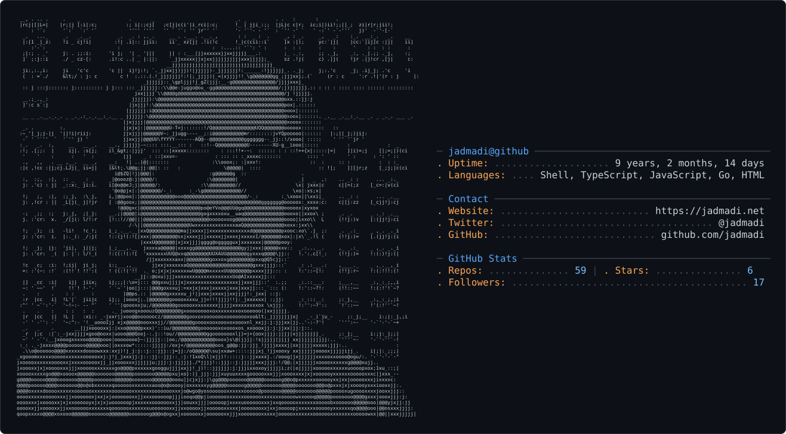

<picture>
  <source media="(prefers-color-scheme: dark)" srcset="dark_mode.svg" />
  <source media="(prefers-color-scheme: light)" srcset="light_mode.svg" />
  
</picture>

## Hi there 👋 I'm Jad.

I build **AI coding devtools** and **Islamic-tech (وقف تك)** software. Working in Go, TypeScript, and SQLite — local-first, fast, and read-only by default.

### Projects

#### AI Devtools — the streak & memory family

| Project | Lang | What it does |
|---------|------|--------------|
| [`thermal`](https://github.com/jadmadi/thermal) | Go | GitHub-style contribution heatmap for AI coding tools (Devin, OpenCode, MiMoCode, Codex, codewhale, command-code, Agy). Leaderboard mode ranks all installed tools by tokens, cost, and streaks. |
| [`sila`](https://github.com/jadmadi/sila) | Go | Local-first knowledge engine that consolidates session memory, handoffs, and codebase facts across Devin, Claude Code, OpenCode, Codex, Antigravity, and MiMo into one queryable SQLite store. 27-tool MCP server. |
| [`open-streak`](https://github.com/jadmadi/open-streak) | TS | GitHub-style terminal activity heatmap for your OpenCode usage data. |
| [`mimo-streak`](https://github.com/jadmadi/mimo-streak) | TS | GitHub-style terminal activity heatmap for your MiMoCode usage data. |

#### WaqfTech — Islamic-tech (وقف تك)

| Project | Lang | What it does |
|---------|------|--------------|
| [`waqftech-markdown-editor`](https://github.com/WaqfTech/waqftech-markdown-editor) | TS | Lightweight Markdown editor with built-in auto-formatting for Islamic texts — Quranic brackets, Hadith quotation marks, and classical ligatures. [Live demo](https://markdown.waqf.dev). |
| [`waqf-license-draft`](https://github.com/WaqfTech/waqf-license-draft) | — | WaqfDPL-Isnad 1.0 — a digital public license (رُخصة وَقْف الرَّقْمِيَّة) governing Islamic-content software released as وقف لله تعالى. |

#### Editor themes

| Project | Lang | What it does |
|---------|------|--------------|
| [`zed-mimoCode-theme`](https://github.com/jadmadi/zed-mimoCode-theme) | JSON | Warm dark/light theme pair for Zed with signature orange accents. |

### Statistics

<!-- rank_icon=percentile -->

 

### Social

#### 📫 How to reach me:

- [@jadmadi](https://twitter.com/jadmadi)
- ✉️ jadmadi@duck.com

#### 👷 Currently working on

{{range recentContributions 5}}
- [{{.Repo.Name}}]({{.Repo.URL}}) - {{.Repo.Description}} ({{humanize .OccurredAt}})
{{- end}}

#### 📜 My recent blog posts

{{range rss "https://jadmadi.net/rss.xml" 2}}
- [{{.Title}}]({{.URL}}) ({{humanize .PublishedAt}})
{{- end}}
